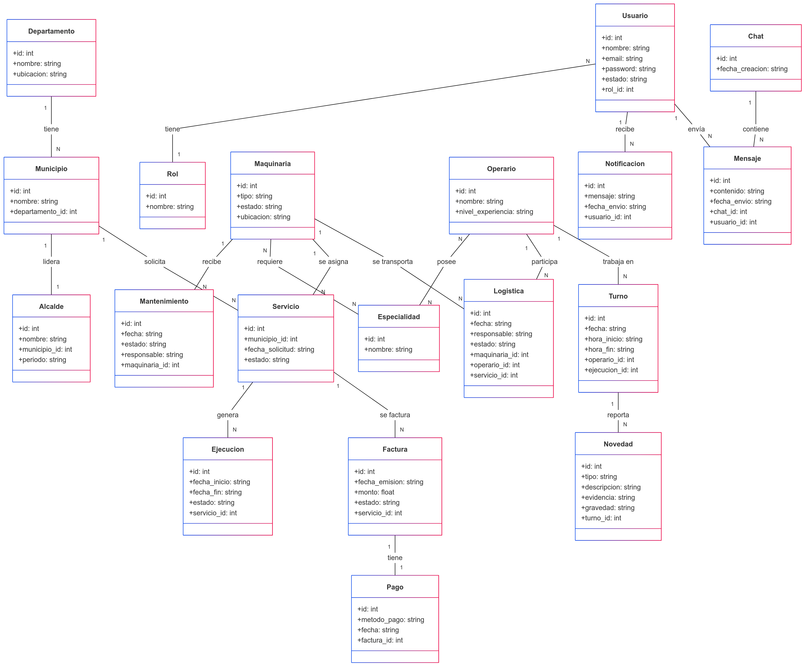

# Proyecto_Prog3

## Entidades

### Entidad: Departamento (Ente departamental)
- **Descripción**: Representa el ente gubernamental encargado de la gestión y asignación de recursos en los municipios.
- **Atributos**: 
  - `id`: Identificador único del departamento.
  - `nombre`: Nombre del departamento.
  - `ubicacion`: Ubicación geográfica del departamento.

---

### Entidad: Municipio
- **Descripción**: Representa una unidad territorial bajo la administración de un alcalde.
- **Atributos**: 
  - `id`: Identificador único del municipio.
  - `nombre`: Nombre del municipio.
  - `departamento_id`: Identificador del departamento al que pertenece.

---

### Entidad: Alcalde
- **Descripción**: Representa al líder político de un municipio.
- **Atributos**: 
  - `id`: Identificador único del alcalde.
  - `nombre`: Nombre completo del alcalde.
  - `municipio_id`: Municipio al que está asignado.
  - `periodo`: Período de gobierno.

---

### Entidad: Usuario
- **Descripción**: Representa a las personas que interactúan con el sistema, como administradores, operarios y alcaldes.
- **Atributos**: 
  - `id`: Identificador único del usuario.
  - `nombre`: Nombre completo del usuario.
  - `email`: Correo electrónico para inicio de sesión.
  - `password`: Contraseña cifrada.
  - `estado`: Estado del usuario (activo/inactivo).
  - `rol_id`: Identificador del rol asignado.

---

### Entidad: Rol *(Adición)*
- **Descripción**: Define los roles y permisos que puede tener un usuario dentro del sistema.
- **Atributos**: 
  - `id`: Identificador único del rol.
  - `nombre`: Nombre del rol (Ej. Administrador, Operario, Alcalde).

---

### Entidad: Maquinaria
- **Descripción**: Representa los equipos utilizados para la ejecución de servicios.
- **Atributos**: 
  - `id`: Identificador único de la maquinaria.
  - `tipo`: Tipo de maquinaria (excavadora, cargadora, etc.).
  - `estado`: Estado de la maquinaria (disponible, en uso, en mantenimiento).
  - `ubicacion`: Ubicación actual de la maquinaria.

---

### Entidad: Especialidad *(Adición)*
- **Descripción**: Representa las especialidades de las maquinarias y los operarios.
- **Atributos**: 
  - `id`: Identificador único de la especialidad.
  - `nombre`: Nombre de la especialidad (Ej. Excavación, Pavimentación).

---

### Entidad: Operario
- **Descripción**: Representa a los trabajadores que manejan la maquinaria.
- **Atributos**: 
  - `id`: Identificador único del operario.
  - `nombre`: Nombre completo del operario.
  - `nivel_experiencia`: Nivel de experiencia del operario.

---

### Entidad: Servicio (Proyectos)
- **Descripción**: Representa un servicio de obra pública solicitado por un municipio.
- **Atributos**: 
  - `id`: Identificador único del servicio.
  - `municipio_id`: Municipio que solicita el servicio.
  - `fecha_solicitud`: Fecha en la que se realiza la solicitud.
  - `estado`: Estado del servicio (pendiente, aprobado, en ejecución).

---

### Entidad: Ejecución
- **Descripción**: Representa la ejecución de un servicio solicitado.
- **Atributos**: 
  - `id`: Identificador único de la ejecución.
  - `fecha_inicio`: Fecha de inicio de la ejecución.
  - `fecha_fin`: Fecha de finalización.
  - `estado`: Estado de la ejecución (en progreso, finalizado).

---

### Entidad: Mantenimiento
- **Descripción**: Representa las reparaciones y revisiones periódicas de la maquinaria.
- **Atributos**: 
  - `id`: Identificador único del mantenimiento.
  - `fecha`: Fecha del mantenimiento.
  - `estado`: Estado del mantenimiento (pendiente, en proceso, finalizado).
  - `responsable`: Nombre del responsable del mantenimiento.

---

### Entidad: Factura
- **Descripción**: Representa el documento generado por un servicio ejecutado.
- **Atributos**: 
  - `id`: Identificador único de la factura.
  - `fecha_emision`: Fecha de emisión de la factura.
  - `monto`: Monto total a pagar.
  - `estado`: Estado del pago (pendiente, pagado).

---

### Entidad: Pago
- **Descripción**: Representa el pago realizado por un servicio facturado.
- **Atributos**: 
  - `id`: Identificador único del pago.
  - `metodo_pago`: Método de pago utilizado (tarjeta, transferencia, etc.).
  - `fecha`: Fecha del pago.

---

### Entidad: Novedad *(Adición)*
- **Descripción**: Representa cualquier incidencia o reporte registrado durante un turno de trabajo.
- **Atributos**: 
  - `id`: Identificador único de la novedad.
  - `tipo`: Tipo de novedad (daño, retraso, incidente).
  - `descripcion`: Descripción de la novedad.
  - `evidencia`: Documentos o imágenes adjuntas.
  - `gravedad`: Nivel de gravedad de la novedad.
  - `turno_id`: Turno en el que se registró la novedad.

---

### Entidad: Chat
- **Descripción**: Representa un canal de comunicación entre usuarios del sistema.
- **Atributos**: 
  - `id`: Identificador único del chat.
  - `fecha_creacion`: Fecha de creación del chat.

---

### Entidad: Mensaje
- **Descripción**: Representa los mensajes intercambiados en un chat.
- **Atributos**: 
  - `id`: Identificador único del mensaje.
  - `contenido`: Contenido del mensaje.
  - `fecha_envio`: Fecha de envío del mensaje.

---

### Entidad: Turno
- **Descripción**: Representa el horario de trabajo de un operario en la ejecución de un servicio.
- **Atributos**: 
  - `id`: Identificador único del turno.
  - `fecha`: Fecha del turno.
  - `hora_inicio`: Hora de inicio del turno.
  - `hora_fin`: Hora de finalización del turno.

---

### Entidad: Logística
- **Descripción**: Representa la gestión del transporte y distribución de maquinaria y operarios para la ejecución de servicios.
- **Atributos**: 
  - `id`: Identificador único de la logística.
  - `fecha`: Fecha de la operación logística.
  - `responsable`: Nombre del encargado de la logística.
  - `estado`: Estado de la operación (pendiente, en proceso, completada).

---

